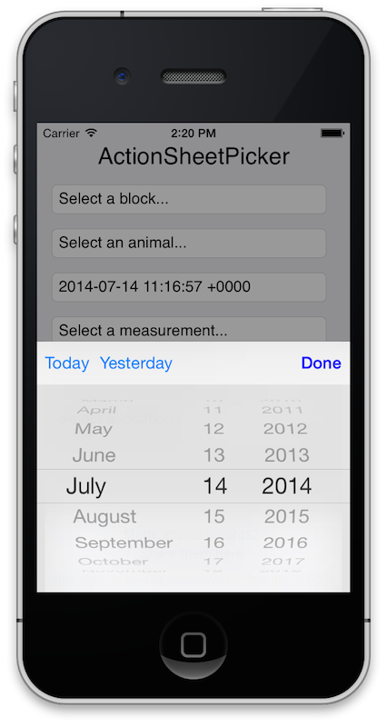

## Attention:

This repo is **outdated**. You can find new version of ActionSheetPicker (iOS 8 compatible alredy) here: [**ActionSheetPicker-3.0**](https://github.com/skywinder/ActionSheetPicker-3.0).

I try to resolve a lot of pull requests and issues in this repo by time, but new updates will be appeared in https://github.com/skywinder/ActionSheetPicker-3.0. I forked from this repo and implement a bunch of fixes.


*Regards,*
*Petr Korolev.*

---

### ActionSheetPicker = UIPickerView + UIActionSheet ###

Well, that's how it started. Now, the following is more accurate:

 * _**iPhone/iPod** ActionSheetPicker = ActionSheetPicker = A Picker + UIActionSheet_
 * _**iPad** ActionSheetPicker = A Picker + UIPopoverController_


## Overview ##
ActionSheetPicker
https://github.com/TimCinel/ActionSheetPicker

Easily present an ActionSheet with a PickerView, allowing user to select from a number of immutible options. Based on the HTML drop-down alternative found in mobilesafari.

Improvements more than welcome - they are kindly requested :)


## Benefits ##

 * Spawn pickers with convenience function - delegate or reference
   not required. Just provide a target/action callback.
 * Add buttons to UIToolbar for quick selection (see ActionSheetDatePicker below)
 * Delegate protocol available for more control
 * Universal (iPhone/iPod/iPad)

## Quickstart ##

There are 4 distinct picker view options: `ActionSheetStringPicker`, `ActionSheetDistancePicker`, `ActionSheetDatePicker`, and `ActionSheetCustomPicker`. We'll focus here on how to use the `ActionSheetStringPicker` since it's most likely the one you want to use.

#### Basic Usage:

```objective-c
// Inside a IBAction method:

// Create an array of strings you want to show in the picker:
NSArray *colors = [NSArray arrayWithObjects:@"Red", @"Green", @"Blue", @"Orange", nil];

[ActionSheetStringPicker showPickerWithTitle:@"Select a Color"
                                        rows:colors
                            initialSelection:0
                                   doneBlock:nil
                                 cancelBlock:nil
                                      origin:sender];
```

#### But you probably want to know when something happens, huh?

```obj-c
// Inside a IBAction method:

// Create an array of strings you want to show in the picker:
NSArray *colors = [NSArray arrayWithObjects:@"Red", @"Green", @"Blue", @"Orange", nil];

[ActionSheetStringPicker showPickerWithTitle:@"Select a Color"
                                        rows:colors
                            initialSelection:0
                                   doneBlock:^(ActionSheetStringPicker *picker, NSInteger selectedIndex, id selectedValue) {
                                      NSLog(@"Picker: %@", picker);
                                      NSLog(@"Selected Index: %@", selectedIndex);
                                      NSLog(@"Selected Value: %@", selectedValue);
                                    }
                                 cancelBlock:^(ActionSheetStringPicker *picker) {
                                      NSLog(@"Block Picker Canceled");
                                    }
                                      origin:sender];
// You can also use self.view if you don't have a sender
```

## Screen Shots ##





## ActionSheetCustomPicker Customization

ActionSheetCustomPicker provides the following delegate function that can be used for customization:

```obj-c
- (void)actionSheetPicker:(AbstractActionSheetPicker *)actionSheetPicker configurePickerView:(UIPickerView *)pickerView;
```
This method is called right before `actionSheetPicker` is presented and it can be used to customize the appearance and properties of the `actionSheetPicker` and the `pickerView` associated with it.

## Credits ##

Thanks to all of the contributors for making ActionSheetPicker better for the iOS developer community. See AUTHORS for details.


### Contributors ###

[Filote Stefan](http://github.com/sfilo)

[Brett Gibson](http://github.com/brettg)

[John Garland](http://github.com/johnnyg) (iPad!)

[Mark van den Broek](http://github.com/heyhoo)

[Evan Cordell](http://github.com/ecordell)

[Greg Combs](http://github.com/grgcombs) (Refactor!)

[Petr Korolev](http://github.com/skywinder) (Update, crashfix, update for iOS7, new pickers)

[Nikos Mouzakitis](http://github.com/NikDude)

### Creator ###

[Tim Cinel](http://github.com/TimCinel)

[@TimCinel](http://twitter.com/TimCinel)

[timcinel.com/](http://www.timcinel.com/)
